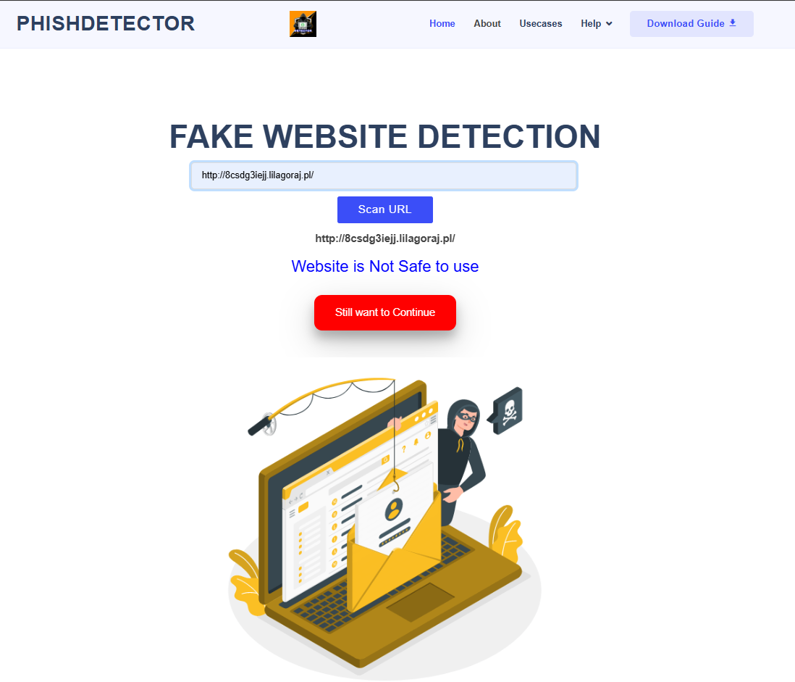

# Phishing Detection System with Chrome Extension

A comprehensive phishing detection system that includes a Chrome extension for real-time detection and a Python-based backend for URL analysis using machine learning.

## Features

- Real-time phishing detection through Chrome extension
- Machine learning-based URL analysis
- Python backend with feature extraction
- User-friendly interface
- Toggle protection on/off
- Detailed analysis results

## Example Output

### Safe Website


### Phishing Warning


## Project Components

1. Chrome Extension (`phishing-extension/`)
   - Real-time URL monitoring
   - User interface for results
   - Communication with backend

2. Python Backend (`Phishing-detector/`)
   - Machine learning model
   - Feature extraction
   - URL analysis
   - API endpoints

## Installation

1. Clone this repository:
```bash
git clone https://github.com/yourusername/phishing-detection-system.git
```

2. Set up the Python backend:
   - Install required dependencies
   - Start the Flask server

3. Load the extension in Chrome:
   - Open Chrome and go to `chrome://extensions/`
   - Enable "Developer mode" in the top right
   - Click "Load unpacked" and select the `phishing-extension` folder

## Project Structure

```
phishing-detection-system/
├── phishing-extension/     # Chrome extension files
│   ├── manifest.json       # Extension configuration
│   ├── popup.html         # Extension popup UI
│   ├── popup.js           # Popup functionality
│   ├── content.js         # Content script for URL analysis
│   └── icons/             # Extension icons
├── Phishing-detector/     # Python backend
│   ├── feature.py         # Feature extraction module
│   ├── app.py            # Flask application
│   └── model/            # Machine learning models
└── README.md             # Project documentation
```

## Usage

1. Start the Python backend server
2. Click the extension icon in Chrome's toolbar
3. Toggle the protection switch to enable/disable
4. The system will automatically analyze URLs and warn about potential phishing sites

## Development

The system combines a Chrome extension for user interaction with a Python backend that performs machine learning-based analysis. The analysis uses various features extracted from URLs and website content to detect potential phishing attempts.

## License

This project is licensed under the MIT License - see the LICENSE file for details.

## Acknowledgments

- Machine learning models for phishing detection
- Chrome Extension API
- Flask framework
- Various open-source libraries 